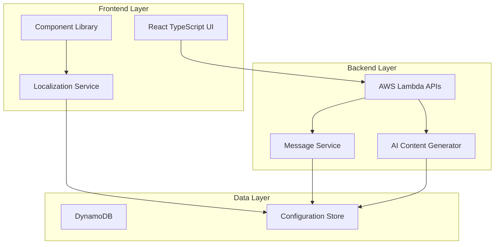

# 設計文書

## 概要

製造業プラチナアドバイザリー・プラットフォームの文言・ブランディング更新は、既存の「Honda Veteran Talent Bank」から「製造業プラチナアドバイザリー」への統一されたブランド体験を提供するための包括的な更新です。この設計では、フロントエンドとバックエンドの両方で文言を統一し、「人を活かす、新しい製造業の生態系」というコンセプトを反映したブランディングを実現します。

## アーキテクチャ

### システム構成



### ブランディング更新戦略

1. **段階的更新**: フロントエンド → バックエンド → AI生成コンテンツの順で更新
2. **設定駆動**: ハードコーディングではなく設定ファイルベースの用語管理
3. **一貫性保証**: 中央集権的な用語辞書による統一性確保
4. **後方互換性**: 既存のAPI構造とデータスキーマを維持

## コンポーネントと インターフェース

### フロントエンド コンポーネント

#### 1. ブランディング設定サービス
```typescript
interface BrandingConfig {
  applicationTitle: string;
  navigationTerms: Record<string, string>;
  systemMessages: Record<string, string>;
  colorTheme: ThemeConfig;
}

interface ThemeConfig {
  primary: string;
  secondary: string;
  accent: string;
  background: string;
}
```

#### 2. 用語変換サービス
```typescript
interface TermMappingService {
  mapLegacyTerm(legacyTerm: string): string;
  getLocalizedTerm(key: string): string;
  validateTermConsistency(): boolean;
}
```

#### 3. 更新対象コンポーネント
- **App.tsx**: アプリケーションタイトル
- **Navigation**: メニュー項目とラベル
- **Dashboard**: 統計表示とメッセージ
- **ProfileManagement**: プロフィール関連用語
- **RecommendationsList**: 推薦システム用語
- **ApplicationTracker**: 応募システム用語
- **PublicVeteranSearch**: 外部プラットフォーム用語

### バックエンド コンポーネント

#### 1. メッセージ設定サービス
```python
class MessageConfig:
    def __init__(self):
        self.error_messages: Dict[str, str] = {}
        self.success_messages: Dict[str, str] = {}
        self.log_templates: Dict[str, str] = {}
    
    def get_message(self, key: str, **kwargs) -> str:
        pass
    
    def format_log_message(self, template_key: str, **kwargs) -> str:
        pass
```

#### 2. AI コンテンツ設定
```python
class AIContentConfig:
    def __init__(self):
        self.questionnaire_prompts: Dict[str, str] = {}
        self.recommendation_templates: Dict[str, str] = {}
        self.business_title_context: str = ""
    
    def get_branded_prompt(self, context: str) -> str:
        pass
```

## データモデル

### 用語マッピング設定

```json
{
  "termMappings": {
    "legacy_terms": {
      "Honda Veteran Talent Bank": "製造業プラチナアドバイザリー",
      "ベテラン": "登録人材",
      "問診": "スキル棚卸し",
      "ベテランプロフィール": "スキルポートフォリオ",
      "推薦機会": "参画機会レコメンド",
      "応募": "参画申請",
      "興味表明": "参画意向",
      "ベテラン検索": "登録人材検索"
    },
    "ui_labels": {
      "dashboard_title": "製造業プラチナアドバイザリー ダッシュボード",
      "profile_section": "スキルポートフォリオ管理",
      "questionnaire_section": "スキル棚卸し",
      "recommendations_section": "参画機会レコメンド",
      "applications_section": "参画申請状況"
    }
  }
}
```

### ブランディング設定

```json
{
  "branding": {
    "theme": {
      "primary": "#2C5282",
      "secondary": "#4A5568", 
      "accent": "#3182CE",
      "background": "#F7FAFC"
    },
    "messaging": {
      "tagline": "人を活かす、新しい製造業の生態系",
      "tone": "professional_supportive",
      "voice": "empowering_collaborative"
    }
  }
}
```

### メッセージテンプレート

```json
{
  "messages": {
    "success": {
      "profile_updated": "スキルポートフォリオが正常に更新されました",
      "application_submitted": "参画申請が正常に送信されました",
      "questionnaire_completed": "スキル棚卸しが完了しました"
    },
    "errors": {
      "profile_validation_failed": "スキルポートフォリオの検証に失敗しました",
      "application_failed": "参画申請の処理中にエラーが発生しました",
      "questionnaire_incomplete": "スキル棚卸しが不完全です"
    }
  }
}
```

## 正確性プロパティ

*プロパティとは、システムのすべての有効な実行において真であるべき特性や動作のことです。これは、人間が読める仕様と機械で検証可能な正確性保証の橋渡しとなる正式な記述です。*

前作業分析に基づいて、以下の正確性プロパティを定義します：

### プロパティ 1: 用語マッピング一貫性
*任意の* UI要素において、レガシー用語が新しい用語に正確にマッピングされ、一貫して表示される
**検証対象: 要件 1.1, 1.2, 1.4, 1.5, 2.1, 2.2, 3.1, 6.3**

### プロパティ 2: ダッシュボード用語統一
*任意の* ダッシュボード表示要素において、すべての統計表示とメッセージで新しい用語が使用される
**検証対象: 要件 1.3**

### プロパティ 3: 応募システム用語統一
*任意の* 応募関連機能において、すべてのステータス表示で新しい用語が使用される
**検証対象: 要件 2.3**

### プロパティ 4: 検索結果用語統一
*任意の* 検索結果表示において、すべての人材関連用語で新しい用語が使用される
**検証対象: 要件 3.2**

### プロパティ 5: APIレスポンス用語統一
*任意の* APIレスポンス（成功・エラー）において、新しい用語を使用したメッセージが返される
**検証対象: 要件 4.1, 4.2**

### プロパティ 6: ログメッセージ用語統一
*任意の* システムログ出力において、新しい用語が使用される
**検証対象: 要件 4.3**

### プロパティ 7: AI生成コンテンツ用語統一
*任意の* AI生成コンテンツ（問診、レコメンド、ビジネスタイトル）において、新しい用語とブランドコンセプトが反映される
**検証対象: 要件 5.1, 5.2, 5.3**

### プロパティ 8: システム不変性保証
*任意の* ブランディング更新において、既存のAPI構造、データベーススキーマ、機能的動作、テスト実行可能性が維持される
**検証対象: 要件 7.1, 7.2, 7.3, 7.4**

### プロパティ 9: 画面間用語一貫性
*任意の* 画面表示において、用語が統一され一貫している
**検証対象: 要件 8.1**

### プロパティ 10: レスポンシブデザイン維持
*任意の* デバイスサイズにおいて、レスポンシブデザインが適切に表示される
**検証対象: 要件 8.4**

## エラーハンドリング

### エラー分類

1. **用語マッピングエラー**: 未定義の用語や不正なマッピング
2. **設定読み込みエラー**: ブランディング設定ファイルの読み込み失敗
3. **AI生成エラー**: AI生成コンテンツでの用語適用失敗
4. **レンダリングエラー**: UI要素での用語表示失敗

### エラー処理戦略

```typescript
class BrandingErrorHandler {
  handleTermMappingError(term: string): string {
    // フォールバック: 元の用語を返す
    console.warn(`Term mapping not found for: ${term}`);
    return term;
  }
  
  handleConfigLoadError(): BrandingConfig {
    // フォールバック: デフォルト設定を返す
    return this.getDefaultConfig();
  }
  
  handleAIContentError(context: string): string {
    // フォールバック: 基本的なメッセージを返す
    return this.getBasicMessage(context);
  }
}
```

### ログ戦略

```python
class BrandingLogger:
    def log_term_mapping(self, old_term: str, new_term: str):
        logger.info(f"用語マッピング適用: {old_term} -> {new_term}")
    
    def log_config_update(self, config_type: str):
        logger.info(f"ブランディング設定更新: {config_type}")
    
    def log_ai_content_generation(self, content_type: str, success: bool):
        status = "成功" if success else "失敗"
        logger.info(f"AI生成コンテンツ {content_type}: {status}")
```

## テスト戦略

### 二重テストアプローチ

**ユニットテスト**: 特定の例、エッジケース、エラー条件を検証
- 用語マッピング関数の正確性
- 設定ファイル読み込みの堅牢性
- UI コンポーネントの表示内容
- API レスポンスメッセージの内容

**プロパティベーステスト**: すべての入力にわたる普遍的プロパティを検証
- 最低100回の反復実行で包括的な入力カバレッジを確保
- 各プロパティテストは設計文書のプロパティを参照
- タグ形式: **Feature: platinum-advisory-rebranding, Property {number}: {property_text}**

### プロパティベーステスト設定

**JavaScript/TypeScript**: fast-check ライブラリを使用
```typescript
import fc from 'fast-check';

// Feature: platinum-advisory-rebranding, Property 1: 用語マッピング一貫性
test('term mapping consistency', () => {
  fc.assert(fc.property(
    fc.string(),
    (legacyTerm) => {
      const mappedTerm = termMappingService.mapLegacyTerm(legacyTerm);
      // プロパティ: マッピングされた用語は一貫している
      return mappedTerm === termMappingService.mapLegacyTerm(legacyTerm);
    }
  ), { numRuns: 100 });
});
```

**Python**: Hypothesis ライブラリを使用
```python
from hypothesis import given, strategies as st

# Feature: platinum-advisory-rebranding, Property 5: APIレスポンス用語統一
@given(st.text())
def test_api_response_term_consistency(message_key):
    """任意のAPIレスポンスで新しい用語が使用される"""
    response = message_service.get_message(message_key)
    # プロパティ: レスポンスに旧用語が含まれていない
    assert not contains_legacy_terms(response)
```

### テストカバレッジ要件

1. **フロントエンド**: 全UIコンポーネントでの用語表示
2. **バックエンド**: 全APIエンドポイントでのメッセージ内容
3. **AI生成**: 全生成コンテンツでの用語使用
4. **設定管理**: 全設定ファイルの読み込みと適用
5. **エラーハンドリング**: 全エラーケースでのフォールバック動作

### 統合テスト

```typescript
describe('End-to-End Branding Consistency', () => {
  test('complete user journey uses consistent terminology', async () => {
    // ユーザージャーニー全体で用語の一貫性を検証
    const journey = await simulateUserJourney();
    expect(journey.allTermsConsistent).toBe(true);
  });
});
```

この設計により、既存機能を維持しながら、統一されたブランド体験を提供する包括的なブランディング更新が実現されます。