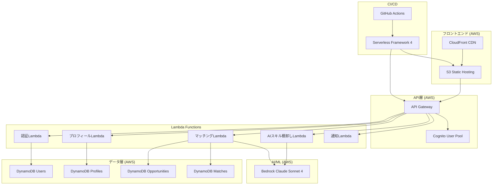
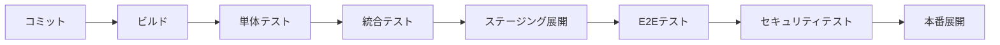

# 設計文書

## 概要

双日テックイノベーション：AI人材発掘・配置マッチングMVP（AI CoE支援）は、マイクロサービスアーキテクチャを採用し、AIスキル棚卸し（セルフ診断）システム、スキル／経験プロファイル管理、マッチング推薦エンジン、同意に基づく社内ポジション公開・検索プラットフォームを統合したWebアプリケーションです。「AI内製化を前進させるための人材発掘と適材配置」という考え方のもと、スケーラビリティ、セキュリティ、ユーザビリティを重視して設計されています。

## アーキテクチャ

### AWS Serverless アーキテクチャ



### 技術スタック

- **フロントエンド**: React.js with TypeScript
- **バックエンド**: Python 3.12 with FastAPI/Flask
- **データベース**: DynamoDB
- **AI/ML**: AWS Bedrock (Claude Sonnet 4 Cross-region inference)
- **認証**: AWS Cognito
- **インフラ**: AWS Serverless (Lambda, API Gateway, S3, CloudFront)
- **デプロイ**: Serverless Framework 4 + GitHub Actions
- **API**: RESTful API

## コンポーネントと インターフェース

### 1. 認証・認可サービス (AWS Cognito + Lambda)

**責任**: ユーザー認証、権限管理、セッション管理

**主要機能**:
- AWS Cognito User Pool統合
- AIポジションオーナー／社内AI人材候補の認証
- 役割ベースアクセス制御 (RBAC)
- セキュリティ監査ログ

**Lambda関数**:
- `auth-handler`: 認証処理とトークン検証
- `user-management`: ユーザー管理とプロフィール初期化

**API エンドポイント**:
```
POST /auth/login
POST /auth/logout
GET /auth/profile
PUT /auth/permissions
```

### 2. プロフィール管理サービス (Lambda + DynamoDB)

**責任**: 社内AI人材候補（社員）プロファイルの作成、更新、管理

**主要機能**:
- プロフィール CRUD 操作
- プライバシー設定管理
- スキル資産の構造化（技能・経験・資格）
- AIスキルポートフォリオ見出し生成 (Bedrock Claude使用)

**Lambda関数**:
- `profile-handler`: プロフィール管理
- `business-title-generator`: AI駆動見出し生成

**DynamoDBテーブル**: `VeteranProfiles`

**API エンドポイント**:
```
GET /profiles/{userId}
PUT /profiles/{userId}
POST /profiles/{userId}/business-title
PUT /profiles/{userId}/privacy
```

### 3. AIスキル棚卸しサービス (Lambda + Bedrock)

**責任**: AIスキル棚卸し（セルフ診断）生成、回答処理、プロフィール更新

**主要機能**:
- 個人向けAIスキル棚卸し生成 (Bedrock Claude使用)
- 回答検証・処理
- スキル／経験プロファイルの自動補完
- AIスキル棚卸し履歴管理

**Lambda関数**:
- `questionnaire-generator`: AIスキル棚卸し生成
- `questionnaire-processor`: 回答処理とプロフィール更新

**DynamoDBテーブル**: `Questionnaires`, `QuestionnaireResponses`

**API エンドポイント**:
```
GET /questionnaire/{userId}
POST /questionnaire/{userId}/submit
GET /questionnaire/{userId}/history
PUT /questionnaire/{userId}/regenerate
```

### 4. マッチング・推薦サービス (Lambda + Bedrock)

**責任**: AIポジション／プロジェクト レコメンド、適合度分析、自薦応募管理

**主要機能**:
- AI駆動推薦アルゴリズム (Bedrock Claude使用)
- AIポジション（社内公募）／AIプロジェクト統合
- 適合度・推薦理由の可視化
- 自薦応募／受入打診状況追跡

**Lambda関数**:
- `matching-engine`: AI推薦エンジン
- `application-handler`: 自薦応募管理

**DynamoDBテーブル**: `Opportunities`, `Recommendations`, `Applications`

**API エンドポイント**:
```
GET /recommendations/{userId}
POST /applications/{userId}
GET /opportunities/search
PUT /applications/{applicationId}/status
```

### 5. 社内ポジション公開・検索統合 (Lambda + S3)

**責任**: 同意に基づく社内ポジション公開・検索（部門横断）機能

**主要機能**:
- 公開プロフィール管理
- AIポジションオーナー向け検索インターフェース
- 候補者マッチング (Bedrock Claude使用)
- 初期接触の仲介（適材配置のための安全な導線）

**Lambda関数**:
- `public-search`: 社内検索API
- `contact-handler`: 連絡先仲介

**DynamoDBテーブル**: `PublicProfiles`, `ContactRequests`

**API エンドポイント**:
```
GET /public/veterans/search
GET /public/veterans/{profileId}
POST /public/contact/{profileId}
GET /public/categories
```

### CI/CD パイプライン

**GitHub Actions ワークフロー**:
```yaml
name: Deploy to AWS
on:
  push:
    branches: [main]
jobs:
  deploy:
    runs-on: ubuntu-latest
    steps:
      - uses: actions/checkout@v3
      - name: Setup Node.js
        uses: actions/setup-node@v3
      - name: Install Serverless Framework
        run: npm install -g serverless@4
      - name: Deploy Backend
        run: serverless deploy
        env:
          AWS_ACCESS_KEY_ID: ${{ secrets.AWS_ACCESS_KEY_ID }}
          AWS_SECRET_ACCESS_KEY: ${{ secrets.AWS_SECRET_ACCESS_KEY }}
          SERVERLESS_ACCESS_KEY: ${{ secrets.SERVERLESS_ACCESS_KEY }}
      - name: Deploy Frontend to S3
        run: aws s3 sync ./frontend/build s3://frontend-bucket
```

## データモデル

### DynamoDB テーブル設計

#### Users テーブル

```python
# DynamoDB Schema
{
    "TableName": "Users",
    "KeySchema": [
        {"AttributeName": "user_id", "KeyType": "HASH"}
    ],
    "AttributeDefinitions": [
        {"AttributeName": "user_id", "AttributeType": "S"},
        {"AttributeName": "email", "AttributeType": "S"}
    ],
    "GlobalSecondaryIndexes": [
        {
            "IndexName": "EmailIndex",
            "KeySchema": [{"AttributeName": "email", "KeyType": "HASH"}]
        }
    ]
}

# Python Data Model
@dataclass
class User:
    user_id: str
    employee_id: str
    email: str
    name: str
    department: str
    join_date: str
    role: str  # 'veteran', 'admin', 'external_recruiter'
    is_active: bool
    created_at: str
    updated_at: str
```

#### VeteranProfiles テーブル - 社内AI人材候補プロファイル（スキル資産）

```python
# DynamoDB Schema
{
    "TableName": "VeteranProfiles",
    "KeySchema": [
        {"AttributeName": "user_id", "KeyType": "HASH"}
    ],
    "AttributeDefinitions": [
        {"AttributeName": "user_id", "AttributeType": "S"},
        {"AttributeName": "is_publicly_visible", "AttributeType": "S"}
    ],
    "GlobalSecondaryIndexes": [
        {
            "IndexName": "PublicProfilesIndex",
            "KeySchema": [{"AttributeName": "is_publicly_visible", "KeyType": "HASH"}]
        }
    ]
}

# Python Data Model
@dataclass
class VeteranProfile:
    user_id: str
    business_title: str
    skills: List[Dict]  # [{"name": str, "level": str, "years": int, "certifications": List[str]}]
    experiences: List[Dict]  # [{"title": str, "department": str, "duration": int, "achievements": List[str]}]
    preferences: Dict  # {"preferred_roles": List[str], "work_style": str, "locations": List[str]}
    privacy_settings: Dict  # {"is_publicly_visible": bool, "external_contact": bool}
    questionnaire_responses: List[Dict]
    is_publicly_visible: str  # "true" or "false" for GSI
    last_updated: str
```

#### Opportunities テーブル - AIポジション（社内公募）／AIプロジェクト

```python
# DynamoDB Schema
{
    "TableName": "Opportunities",
    "KeySchema": [
        {"AttributeName": "opportunity_id", "KeyType": "HASH"}
    ],
    "AttributeDefinitions": [
        {"AttributeName": "opportunity_id", "AttributeType": "S"},
        {"AttributeName": "type", "AttributeType": "S"},
        {"AttributeName": "posted_date", "AttributeType": "S"}
    ],
    "GlobalSecondaryIndexes": [
        {
            "IndexName": "TypeDateIndex",
            "KeySchema": [
                {"AttributeName": "type", "KeyType": "HASH"},
                {"AttributeName": "posted_date", "KeyType": "RANGE"}
            ]
        }
    ]
}

# Python Data Model
@dataclass
class Opportunity:
    opportunity_id: str
    title: str
    description: str
    required_skills: List[str]
    location: str
    type: str  # 'internal_transfer', 'external_position', 'consulting', 'project_based'
    source: str  # 'internal', 'external'
    company: str
    salary_range: Dict  # {"min": int, "max": int, "currency": str}
    is_active: bool
    posted_date: str
    expiry_date: str
```

#### Recommendations テーブル - 適合度レコメンド（推薦理由の説明可能性）

```python
# DynamoDB Schema
{
    "TableName": "Recommendations",
    "KeySchema": [
        {"AttributeName": "user_id", "KeyType": "HASH"},
        {"AttributeName": "recommendation_id", "KeyType": "RANGE"}
    ],
    "AttributeDefinitions": [
        {"AttributeName": "user_id", "AttributeType": "S"},
        {"AttributeName": "recommendation_id", "AttributeType": "S"}
    ]
}

# Python Data Model
@dataclass
class Recommendation:
    user_id: str
    recommendation_id: str
    opportunity_id: str
    match_score: float
    match_reasons: List[Dict]  # [{"category": str, "description": str, "weight": float}]
    status: str  # 'generated', 'viewed', 'applied', 'dismissed'
    generated_at: str
    viewed_at: Optional[str] = None
    applied_at: Optional[str] = None

#### Bedrock Claude 統合

```python
# Bedrock Client Configuration
import boto3

bedrock_client = boto3.client(
    'bedrock-runtime',
    region_name='us-west-2',  # Cross-region inference
    aws_access_key_id=os.environ['AWS_ACCESS_KEY_ID'],
    aws_secret_access_key=os.environ['AWS_SECRET_ACCESS_KEY']
)

# Claude Sonnet 4 Model ID
MODEL_ID = "anthropic.claude-3-5-sonnet-20241022-v2:0"
```

## エラーハンドリング

### エラー分類

1. **認証エラー** (401, 403)
   - 無効なトークン
   - 権限不足
   - セッション期限切れ

2. **バリデーションエラー** (400)
   - 不正な入力データ
   - 必須フィールド不足
   - データ形式エラー

3. **ビジネスロジックエラー** (422)
   - プロフィール不完全
   - 重複自薦応募
   - 利用不可能な機会

4. **システムエラー** (500, 503)
   - データベース接続エラー
   - AI サービス障害
   - 外部API障害

### エラーレスポンス形式

```typescript
interface ErrorResponse {
  error: {
    code: string;
    message: string;
    details?: any;
    timestamp: string;
    requestId: string;
  };
}
```

### 回復戦略

- **自動リトライ**: 一時的な外部サービス障害
- **フォールバック**: AI サービス障害時の基本推薦
- **グレースフル劣化**: 部分的機能提供
- **ユーザー通知**: 重要な機能停止時の適切な案内

## テスト戦略

### 単体テスト
- **カバレッジ目標**: 80%以上
- **対象**: ビジネスロジック、ユーティリティ関数
- **ツール**: Jest, Mocha

### 統合テスト
- **API エンドポイント**: 全エンドポイントのテスト
- **データベース統合**: トランザクション整合性
- **外部サービス**: モック使用

### E2Eテスト
- **ユーザージャーニー**: 主要フロー全体
- **ブラウザテスト**: クロスブラウザ対応
- **ツール**: Cypress, Playwright

### パフォーマンステスト
- **負荷テスト**: 同時ユーザー数
- **ストレステスト**: システム限界
- **AI推論速度**: レスポンス時間測定

### セキュリティテスト
- **脆弱性スキャン**: OWASP Top 10
- **認証テスト**: 権限昇格防止
- **データ保護**: PII漏洩防止

### テスト自動化



## セキュリティ考慮事項

### データ保護
- **暗号化**: 保存時・転送時の暗号化
- **PII保護**: 個人情報の匿名化・仮名化
- **データ保持**: 法的要件に基づく保持期間

### アクセス制御
- **最小権限原則**: 必要最小限のアクセス権
- **多要素認証**: 管理者アカウント
- **監査ログ**: 全アクセスの記録

### AI倫理・バイアス対策
- **公平性**: アルゴリズムバイアス検出・修正
- **透明性**: 推薦理由の説明可能性
- **プライバシー**: AI学習データの匿名化
- **社内適材配置を前提とした公平性**: 部門や役職による偏見を排除
- **個人情報の取り扱い**: 同意・匿名化・共有範囲の適切な管理
- **倫理的運営**: 透明な運営モデル
