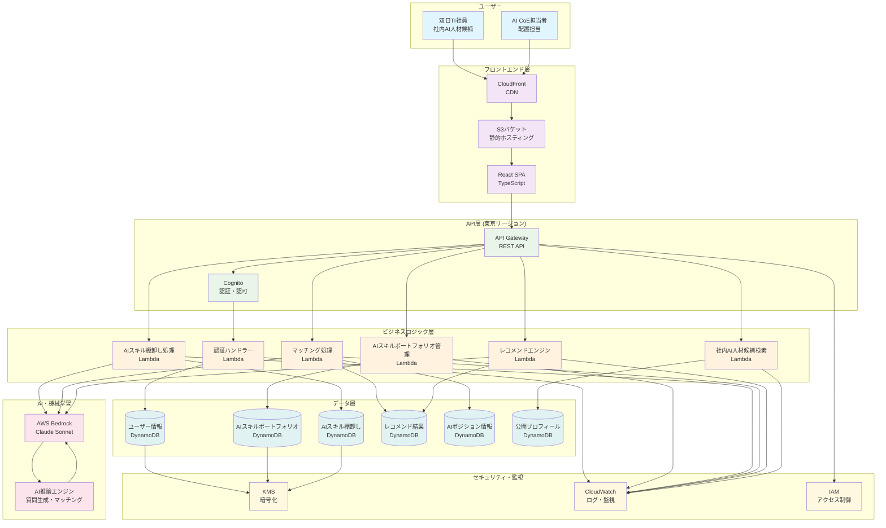
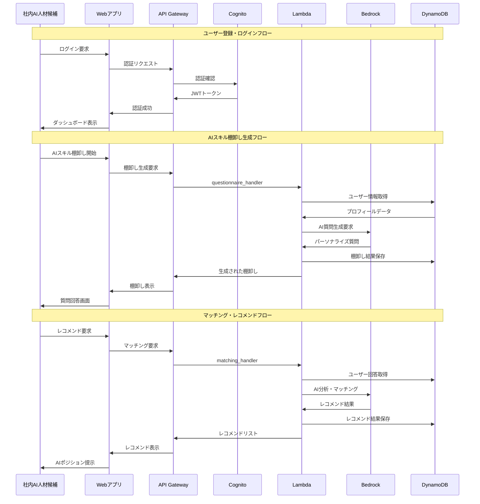
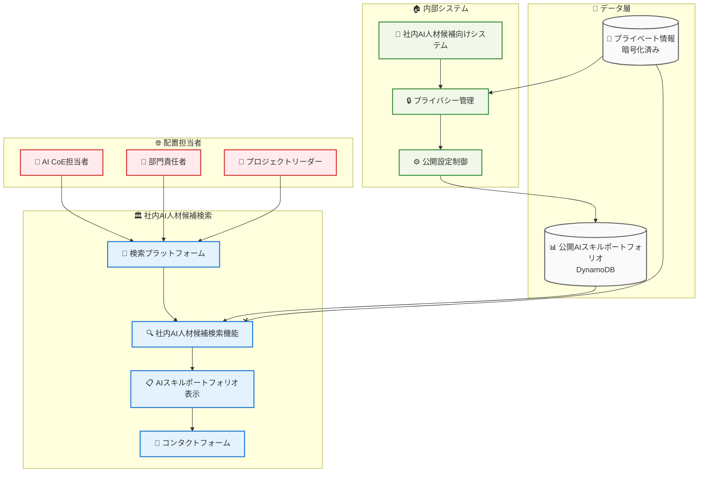

# 双日テックイノベーション AI人材発掘・配置マッチングMVP（AI CoE支援）

AI を活用した社内AI人材発掘・配置マッチングシステム。双日テックイノベーションの社内AI人材候補が、AIスキル棚卸し（セルフ診断）、AIスキルポートフォリオ管理、AIポジション／プロジェクト レコメンドを通じて最適なAIポジションを見つけることを支援します。

## 🚀 主な機能

- **AI生成アンケート（AIスキル棚卸し）**: AWS Bedrock Claude Sonnet 4 を使用したパーソナライズされたAIスキル棚卸し（セルフ診断）
- **AIスキルポートフォリオ管理**: 動的なビジネスタイトル生成とAIスキル評価
- **インテリジェントマッチング**: 社内AIポジション／プロジェクトに対するAI駆動のレコメンデーションエンジン
- **プライバシー制御**: AIスキルポートフォリオ共有のための詳細な可視性設定
- **社内AI人材候補検索**: 外部担当者向けの社内AI人材候補検索プラットフォーム
- **ロールベースアクセス**: Cognito と RBAC による安全な認証

## 🏗️ アーキテクチャ

- **バックエンド**: Python 3.12 + AWS Lambda + Serverless Framework 4
- **フロントエンド**: React 18 + TypeScript + AWS Amplify
- **データベース**: 最適化された GSI 設計の DynamoDB
- **AI/ML**: AWS Bedrock (Claude Sonnet 4 クロスリージョン推論)
- **認証**: AWS Cognito User Pools
- **インフラストラクチャ**: AWS Serverless (API Gateway, S3, CloudFront)
- **CI/CD**: GitHub Actions + Serverless Framework
- **リージョン**: 東京リージョン (ap-northeast-1)

## 📊 システム概要図

### 全体アーキテクチャ



### データフロー図



### 社内AI人材候補検索連携図



## 📋 前提条件

- Python 3.12+
- Node.js 18+
- AWS CLI 設定済み
- Serverless Framework 4
- Git

## 🛠️ インストール

### バックエンドセットアップ

1. リポジトリをクローン:
```bash
git clone https://github.com/leadlea/honda.git
cd honda
```

2. Python 依存関係をインストール:
```bash
pip install -r requirements-dev.txt
```

3. Serverless Framework とプラグインをインストール:
```bash
npm install -g serverless@4
npm install
```

4. AWS 認証情報を設定:
```bash
aws configure
# リージョンを ap-northeast-1 (東京) に設定してください
```

### フロントエンドセットアップ

1. フロントエンドディレクトリに移動:
```bash
cd frontend
```

2. 依存関係をインストール:
```bash
npm install
```

## 🚀 デプロイメント

### 開発環境

1. バックエンドサービスをデプロイ:
```bash
serverless deploy --stage dev --config serverless-minimal.yml
```

2. フロントエンドをビルドしてデプロイ:
```bash
chmod +x scripts/deploy-frontend.sh
./scripts/deploy-frontend.sh dev
```

### 本番環境

1. GitHub Actions 経由でデプロイ:
   - `main` ブランチにプッシュ
   - GitHub Actions が自動的に本番環境にデプロイ

2. 手動デプロイ:
```bash
serverless deploy --stage prod --config serverless-minimal.yml
./scripts/deploy-frontend.sh prod
```

## 🧪 テスト

### ユニットテストの実行
```bash
pytest tests/unit/ --cov=src
```

### 統合テストの実行
```bash
pytest tests/integration/
```

### フロントエンドテストの実行
```bash
cd frontend
npm test
```

### コード品質チェック
```bash
# フォーマット
black src/ tests/
isort src/ tests/

# リンティング
flake8 src/ tests/
mypy src/

# セキュリティ
bandit -r src/
```

## 📁 プロジェクト構造

```
ai-talent-matching-mvp/
├── .github/workflows/          # GitHub Actions CI/CD
├── .kiro/specs/               # 機能仕様書
├── src/                       # Python バックエンドソース
│   ├── handlers/              # Lambda 関数ハンドラー
│   ├── models/                # データモデル
│   ├── services/              # ビジネスロジック
│   ├── repositories/          # データアクセス層
│   └── utils/                 # ユーティリティ関数
├── tests/                     # テストファイル
│   ├── unit/                  # ユニットテスト
│   └── integration/           # 統合テスト
├── frontend/                  # React フロントエンド
│   ├── src/                   # フロントエンドソースコード
│   └── public/                # 静的アセット
├── scripts/                   # デプロイメントスクリプト
├── serverless.yml             # Serverless Framework 設定
├── serverless-minimal.yml     # 最小構成設定
├── requirements.txt           # Python 依存関係
└── package.json               # Node.js 依存関係
```

## 🔧 設定

### 環境変数

異なる環境用の `.env` ファイルを作成:

```bash
# .env.dev
STAGE=dev
AWS_REGION=ap-northeast-1
BEDROCK_MODEL_ID=anthropic.claude-3-5-sonnet-20241022-v2:0

# .env.prod
STAGE=prod
AWS_REGION=ap-northeast-1
BEDROCK_MODEL_ID=anthropic.claude-3-5-sonnet-20241022-v2:0
```

### AWS リソース

システムは以下の AWS リソースを作成します:
- 認証用の Cognito User Pool
- データストレージ用の DynamoDB テーブル
- ビジネスロジック用の Lambda 関数
- REST エンドポイント用の API Gateway
- フロントエンドホスティング用の S3 バケット
- IAM ロールとポリシー

## 📊 監視

- **CloudWatch Logs**: Lambda 関数ログ
- **CloudWatch Metrics**: パフォーマンス監視
- **X-Ray Tracing**: 分散トレーシング（オプション）
- **CodeCov**: テストカバレッジレポート

## 🔒 セキュリティ

- **認証**: JWT トークンを使用した AWS Cognito
- **認可**: ロールベースアクセス制御 (RBAC)
- **データ暗号化**: 保存時および転送時
- **PII 保護**: 匿名化と仮名化
- **セキュリティスキャン**: 自動脆弱性チェック

## 🌏 デプロイメント情報

### 現在のデプロイメント状況
- **リージョン**: 東京 (ap-northeast-1)
- **フロントエンド**: CloudFront + S3 (honda-hr-bank)
- **バックエンド**: API Gateway + Lambda
- **データベース**: DynamoDB
- **AI サービス**: AWS Bedrock (Claude Sonnet)

### アクセス URL
- **フロントエンド**: https://doy5alruji476.cloudfront.net
- **API エンドポイント**: デプロイ後に CloudFormation から取得

## 🤝 貢献

1. リポジトリをフォーク
2. 機能ブランチを作成: `git checkout -b feature/amazing-feature`
3. 変更をコミット: `git commit -m 'Add amazing feature'`
4. ブランチにプッシュ: `git push origin feature/amazing-feature`
5. プルリクエストを開く

## 📝 ライセンス

このプロジェクトは MIT ライセンスの下でライセンスされています - 詳細は [LICENSE](LICENSE) ファイルを参照してください。

## 📞 サポート

サポートと質問については:
- GitHub リポジトリで Issue を作成
- 福原玄（genfukuhara@gmail.com）に連絡

## 🗺️ ロードマップ

- [x] 東京リージョンへの完全移行
- [x] CI/CD パイプラインの構築
- [x] フロントエンドデプロイメントの自動化
- [x] 双日TI向け用語統一リブランディング完了
- [ ] 多言語サポート（日本語/英語）
- [ ] 高度な AI 分析ダッシュボード
- [ ] モバイルアプリケーション
- [ ] 社内AIポジション管理機能の拡充
- [ ] リアルタイム通知
- [ ] AIスキル成長トラッキング

## 🎉 最新の更新

### v1.1.0 - 2026年3月
- ✅ 双日TI向け用語統一リブランディング完了
- ✅ 全画面・全APIで新用語（「社内AI人材候補」「AIスキル棚卸し（セルフ診断）」「AIポジション／プロジェクト レコメンド」「自薦応募」等）に統一

### v1.0.0 - 2025年1月
- ✅ 東京リージョン (ap-northeast-1) への完全移行完了
- ✅ フロントエンドデプロイメント成功
- ✅ CI/CD パイプライン構築完了
- ✅ AWS Bedrock Claude Sonnet 統合
- ✅ セキュリティ強化とパフォーマンス最適化

---

## 本リポジトリの位置づけ / About This Repository

本リポジトリは、合同会社Lead lea（以下「Lead lea」）が開発した  
PoC／MVP 用プロダクトのソースコードを管理するものです。

本リポジトリは、双日テックイノベーション株式会社（以下「クライアント」）における  
**社内検証・PoC・社内デモ用途**での利用を目的として提供しているものであり、  
いかなる企業の正式な受託開発成果物として提供されるものではありません。

This repository stores the source code of a proof-of-concept (PoC) / MVP product  
developed by Lead lea LLC ("Lead lea").

It is provided solely for **internal evaluation, PoC, and internal demo use**  
within Sojitz Techno Innovation Co., Ltd. (the "Client"),  
and is **not** delivered as an official outsourcing deliverable of any company.

---

## 知的財産権 / Intellectual Property

本リポジトリに含まれるソースコード、ドキュメントその他一切の成果物の  
著作権および知的財産権は、特段の合意がない限り、すべて Lead lea に帰属します。

Unless otherwise agreed in writing, all copyrights and intellectual property rights  
in and to the source code, documents, and any other materials contained in this repository  
shall remain the exclusive property of Lead lea.

---

## 利用条件 / Terms of Use

- 利用可能範囲：  
  - 双日テックイノベーション株式会社の社内における利用（PoC、技術検証、社内デモ等）に限ります。  

- 提供形態：  
  - 本リポジトリは **AS IS（現状有姿）** で提供されるものであり、  
    動作保証・性能保証・恒常的な保守義務を Lead lea は負いません。  

- 禁止事項：  
  - 第三者への再配布、商用サービスへの直接組み込み等を行う場合は、  
    事前に Lead lea との協議・書面による合意が必要です。

- Permitted scope of use:  
  - Internal use within Sojitz Techno Innovation Co., Ltd. (PoC, technical evaluation, internal demos, etc.) only.  

- Mode of provision:  
  - This repository is provided **"AS IS"**, and Lead lea does not assume any obligation  
    for warranties, performance guarantees, or ongoing maintenance.  

- Restrictions:  
  - Redistribution to third parties and direct incorporation into commercial services  
    require prior consultation with, and written approval from, Lead lea.

---

## 本番導入・商用利用について / Production & Commercial Use

本リポジトリに含まれる機能を本番システムとして商用利用する場合、  
または大規模な機能追加・カスタマイズを行う場合は、  
別途 Lead lea との間で正式な契約を締結したうえで進めることを前提とします。

If the Client wishes to use any functions contained in this repository  
for production or commercial purposes, or to implement major enhancements  
or customizations, such activities shall be carried out only after  
entering into a separate formal agreement with Lead lea.
