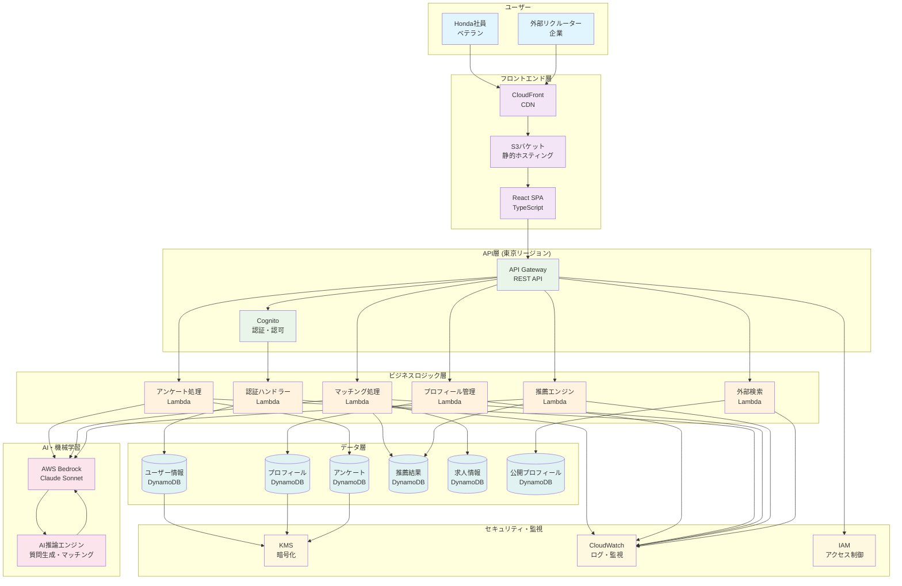
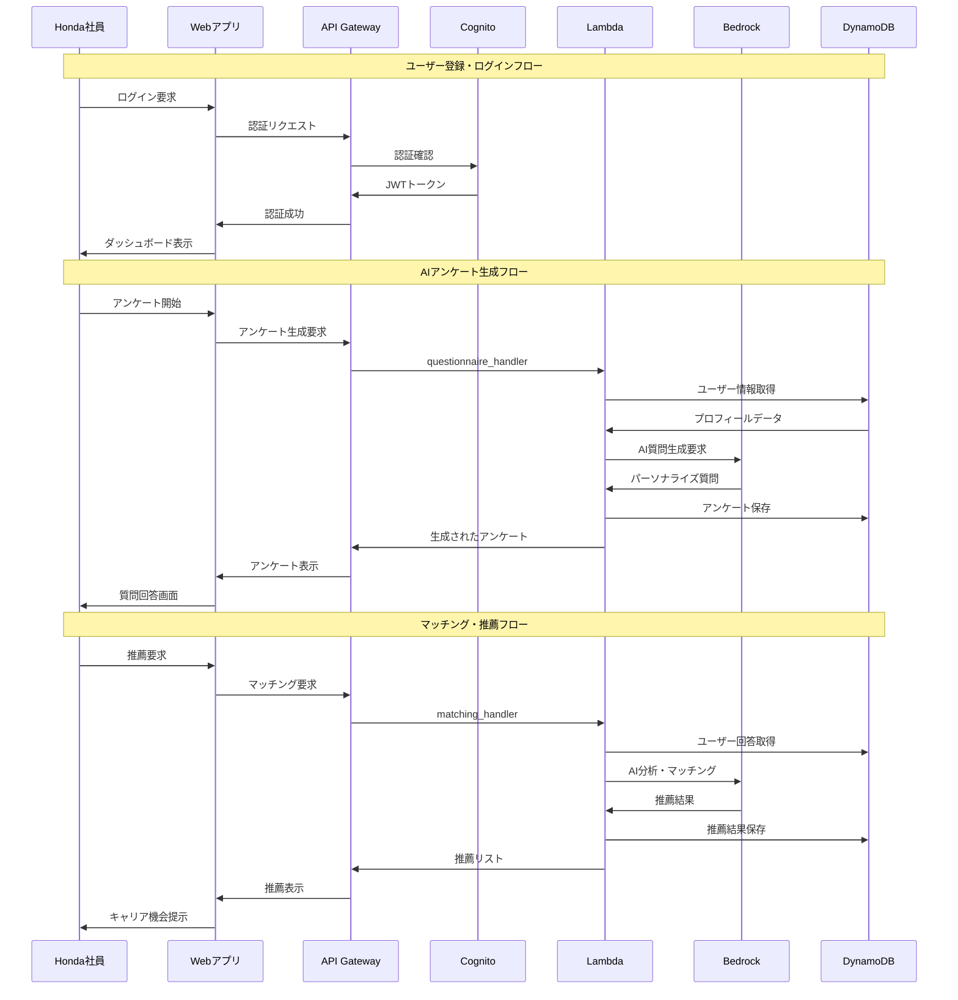

# Honda ベテラン人材マッチングシステム

AI を活用したベテラン人材マッチングシステム。経験豊富な Honda 社員が、インテリジェントなアンケート、プロフィール管理、スマートレコメンデーションを通じて新しいキャリア機会を見つけることを支援します。

## 🚀 主な機能

- **AI 生成アンケート**: AWS Bedrock Claude Sonnet 4 を使用したパーソナライズされたアンケート
- **スマートプロフィール管理**: 動的なビジネスタイトル生成とスキル評価
- **インテリジェントマッチング**: 社内外の機会に対する AI 駆動のレコメンデーションエンジン
- **プライバシー制御**: プロフィール共有のための詳細な可視性設定
- **外部プラットフォーム**: 外部リクルーター向けの Honda ベテランバンク
- **ロールベースアクセス**: Cognito と RBAC による安全な認証

## 🏗️ アーキテクチャ

- **バックエンド**: Python 3.12 + AWS Lambda + Serverless Framework 4
- **フロントエンド**: React 18 + TypeScript + AWS Amplify
- **データベース**: 最適化された GSI 設計の DynamoDB
- **AI/ML**: AWS Bedrock (Claude Sonnet 4 クロスリージョン推論)
- **認証**: AWS Cognito User Pools
- **インフラストラクチャ**: AWS Serverless (API Gateway, S3, CloudFront)
- **CI/CD**: GitHub Actions + Serverless Framework
- **リージョン**: 東京リージョン (ap-northeast-1)

## 📊 システム概要図

### 全体アーキテクチャ



### データフロー図



### 外部プラットフォーム連携図

```mermaid
graph LR
    subgraph "Honda ベテランバンク (外部向け)"
        EP[外部プラットフォーム<br/>公開サイト]
        PS[公開検索<br/>機能]
        PF[プロフィール<br/>表示]
        CONTACT[コンタクト<br/>フォーム]
    end

    subgraph "内部システム"
        IS[内部システム<br/>社員向け]
        PM[プライバシー<br/>管理]
        PP[公開設定<br/>制御]
    end

    subgraph "外部ユーザー"
        REC[リクルーター]
        CORP[企業担当者]
        HEAD[ヘッドハンター]
    end

    subgraph "データ制御"
        PUB[(公開プロフィール<br/>DynamoDB)]
        PRIV[(プライベート情報<br/>暗号化)]
    end

    %% 外部アクセスフロー
    REC --> EP
    CORP --> EP
    HEAD --> EP
    EP --> PS
    PS --> PF
    PF --> CONTACT

    %% 内部制御フロー
    IS --> PM
    PM --> PP
    PP --> PUB

    %% データ分離
    PUB --> PS
    PRIV -.-> PM
    PRIV -.x PS

    %% スタイリング
    classDef externalClass fill:#ffebee
    classDef internalClass fill:#e3f2fd
    classDef userClass fill:#f1f8e9
    classDef dataClass fill:#fafafa

    class EP,PS,PF,CONTACT externalClass
    class IS,PM,PP internalClass
    class REC,CORP,HEAD userClass
    class PUB,PRIV dataClass
```

## 📋 前提条件

- Python 3.12+
- Node.js 18+
- AWS CLI 設定済み
- Serverless Framework 4
- Git

## 🛠️ インストール

### バックエンドセットアップ

1. リポジトリをクローン:
```bash
git clone https://github.com/leadlea/honda.git
cd honda
```

2. Python 依存関係をインストール:
```bash
pip install -r requirements-dev.txt
```

3. Serverless Framework とプラグインをインストール:
```bash
npm install -g serverless@4
npm install
```

4. AWS 認証情報を設定:
```bash
aws configure
# リージョンを ap-northeast-1 (東京) に設定してください
```

### フロントエンドセットアップ

1. フロントエンドディレクトリに移動:
```bash
cd frontend
```

2. 依存関係をインストール:
```bash
npm install
```

## 🚀 デプロイメント

### 開発環境

1. バックエンドサービスをデプロイ:
```bash
serverless deploy --stage dev --config serverless-minimal.yml
```

2. フロントエンドをビルドしてデプロイ:
```bash
chmod +x scripts/deploy-frontend.sh
./scripts/deploy-frontend.sh dev
```

### 本番環境

1. GitHub Actions 経由でデプロイ:
   - `main` ブランチにプッシュ
   - GitHub Actions が自動的に本番環境にデプロイ

2. 手動デプロイ:
```bash
serverless deploy --stage prod --config serverless-minimal.yml
./scripts/deploy-frontend.sh prod
```

## 🧪 テスト

### ユニットテストの実行
```bash
pytest tests/unit/ --cov=src
```

### 統合テストの実行
```bash
pytest tests/integration/
```

### フロントエンドテストの実行
```bash
cd frontend
npm test
```

### コード品質チェック
```bash
# フォーマット
black src/ tests/
isort src/ tests/

# リンティング
flake8 src/ tests/
mypy src/

# セキュリティ
bandit -r src/
```

## 📁 プロジェクト構造

```
honda-veteran-talent-matching/
├── .github/workflows/          # GitHub Actions CI/CD
├── .kiro/specs/               # 機能仕様書
├── src/                       # Python バックエンドソース
│   ├── handlers/              # Lambda 関数ハンドラー
│   ├── models/                # データモデル
│   ├── services/              # ビジネスロジック
│   ├── repositories/          # データアクセス層
│   └── utils/                 # ユーティリティ関数
├── tests/                     # テストファイル
│   ├── unit/                  # ユニットテスト
│   └── integration/           # 統合テスト
├── frontend/                  # React フロントエンド
│   ├── src/                   # フロントエンドソースコード
│   └── public/                # 静的アセット
├── scripts/                   # デプロイメントスクリプト
├── serverless.yml             # Serverless Framework 設定
├── serverless-minimal.yml     # 最小構成設定
├── requirements.txt           # Python 依存関係
└── package.json               # Node.js 依存関係
```

## 🔧 設定

### 環境変数

異なる環境用の `.env` ファイルを作成:

```bash
# .env.dev
STAGE=dev
AWS_REGION=ap-northeast-1
BEDROCK_MODEL_ID=anthropic.claude-3-5-sonnet-20241022-v2:0

# .env.prod
STAGE=prod
AWS_REGION=ap-northeast-1
BEDROCK_MODEL_ID=anthropic.claude-3-5-sonnet-20241022-v2:0
```

### AWS リソース

システムは以下の AWS リソースを作成します:
- 認証用の Cognito User Pool
- データストレージ用の DynamoDB テーブル
- ビジネスロジック用の Lambda 関数
- REST エンドポイント用の API Gateway
- フロントエンドホスティング用の S3 バケット
- IAM ロールとポリシー

## 📊 監視

- **CloudWatch Logs**: Lambda 関数ログ
- **CloudWatch Metrics**: パフォーマンス監視
- **X-Ray Tracing**: 分散トレーシング（オプション）
- **CodeCov**: テストカバレッジレポート

## 🔒 セキュリティ

- **認証**: JWT トークンを使用した AWS Cognito
- **認可**: ロールベースアクセス制御 (RBAC)
- **データ暗号化**: 保存時および転送時
- **PII 保護**: 匿名化と仮名化
- **セキュリティスキャン**: 自動脆弱性チェック

## 🌏 デプロイメント情報

### 現在のデプロイメント状況
- **リージョン**: 東京 (ap-northeast-1)
- **フロントエンド**: CloudFront + S3 (honda-hr-bank)
- **バックエンド**: API Gateway + Lambda
- **データベース**: DynamoDB
- **AI サービス**: AWS Bedrock (Claude Sonnet)

### アクセス URL
- **フロントエンド**: https://doy5alruji476.cloudfront.net
- **API エンドポイント**: デプロイ後に CloudFormation から取得

## 🤝 貢献

1. リポジトリをフォーク
2. 機能ブランチを作成: `git checkout -b feature/amazing-feature`
3. 変更をコミット: `git commit -m 'Add amazing feature'`
4. ブランチにプッシュ: `git push origin feature/amazing-feature`
5. プルリクエストを開く

## 📝 ライセンス

このプロジェクトは MIT ライセンスの下でライセンスされています - 詳細は [LICENSE](LICENSE) ファイルを参照してください。

## 📞 サポート

サポートと質問については:
- GitHub リポジトリで Issue を作成
- Honda 開発チームに連絡

## 🗺️ ロードマップ

- [x] 東京リージョンへの完全移行
- [x] CI/CD パイプラインの構築
- [x] フロントエンドデプロイメントの自動化
- [ ] 多言語サポート（日本語/英語）
- [ ] 高度な AI 分析ダッシュボード
- [ ] モバイルアプリケーション
- [ ] 外部求人サイトとの統合
- [ ] リアルタイム通知
- [ ] ビデオ面接スケジューリング

## 🎉 最新の更新

### v1.0.0 - 2025年1月
- ✅ 東京リージョン (ap-northeast-1) への完全移行完了
- ✅ フロントエンドデプロイメント成功
- ✅ CI/CD パイプライン構築完了
- ✅ AWS Bedrock Claude Sonnet 統合
- ✅ セキュリティ強化とパフォーマンス最適化